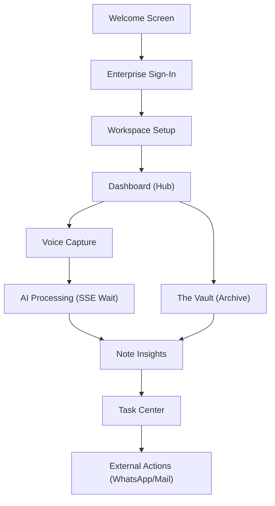

# VoiceNote Enterprise - Technical Overview & Workflow

VoiceNote is a high-fidelity, enterprise-grade AI productivity application built with Jetpack Compose. It transforms audio capture into actionable intelligence through a modular, offline-first native Android architecture, seamlessly integrated with a FastAPI backend.

## 🚀 Vision
To empower enterprise teams with real-time AI insights, seamless transcription, and automated task extraction, all while maintaining strict corporate security and offline reliability.

---

## 🏗️ Architectural Foundations

The application is built on **Clean Architecture** principles with a focus on modularity and testability.

### Layered Structure
- **UI Layer (Jetpack Compose)**: Uses Unidirectional Data Flow (UDF) via Hilt-injected ViewModels.
- **Domain Layer**: Contains business logic, use cases, and repository interfaces.
- **Data Layer (Offline-First)**: 
    - **Room Persistence**: Local cache for notes, tasks, and notifications.
    - **FileSystem**: Secure storage for high-quality audio recordings.
    - **Retrofit Client**: Direct integration with the `VoiceNoteAPI`.
    - **SSE Client**: Server-Sent Events for real-time processing updates via `SSEManager`.

---

## 🔄 Application Workflow

The following journey illustrates the primary user flow from onboarding to actionable insights:



---

## 🛠️ Feature Modules

### 🔐 Authentication & Onboarding
- **Enterprise Portal**: Corporate-specific login with SSO (Azure AD, Google) support.
- **Workspace Setup**: Deep-linkable organization joining and role-based onboarding.
- **Permission Guard**: iOS-style granular permission requested with context-aware benefits.

### 📊 Intelligence Dashboard
- **Velocity Tracking**: ROI and productivity analytics using usage metering.
- **Real-time Status**: SSE-driven updates showing "Processing", "Synced", or "Conflict Detected".

### 📂 The Vault (Knowledge Management)
- **Note Repository**: Hierarchical management of meeting notes and voice memos.
- **Note Insights**: AI-generated Executive Summaries, Key Takeaways, and Sentiment Analysis.
- **RAG Chat**: A global AI assistant capable of answering questions across the entire knowledge base.

### 📋 Actionable Task Center
- **System Integration**: Automated sync with System Calendar and Contacts.
- **Smart Actions**: One-tap triggers for WhatsApp, Maps, and Email based on action items.

### 🎙️ Advanced Voice Capture
- **Diarization Engine**: Multi-speaker identification and labeling.
- **Local Waveform**: Real-time visualization of audio frequency.
- **Batch Sync**: Background optimization for uploading large audio files.

---

## 🔗 Screen to API Alignment

| Screen | Endpoint | Method | Request Payload | Key Response Fields |
| :--- | :--- | :--- | :--- | :--- |
| **Sign-In** | `/api/v1/users/login` | `POST` | `email`, `password`, `device_id`, `token` | `access_token`, `user.id`, `is_new_user` |
| **Workspace** | `/api/v1/users/sync` | `POST` | `email`, `device_model`, `timezone` | `user.primary_role`, `is_verified` |
| **Dashboard** | `/api/v1/notes/dashboard` | `GET` | N/A | `stats.meeting_roi`, `recent_notes`, `ai_insights` |
| **The Vault** | `/api/v1/notes` | `GET` | `skip`, `limit` | `List<NoteDetailResponse>` |
| **Real-time** | `/sse/events` | `Streaming`| N/A | `NOTE_PROCESSED`, `DASHBOARD_UPDATE` |
| **Voice Capture** | `/api/v1/sync/upload-batch` | `POST` | `List<File>` | `batch_job_id`, `processed_count` |
| **Note Insights** | `/api/v1/notes/{id}` | `GET` | `id` | `transcript`, `semantic_analysis`, `tasks` |
| **Task Center** | `/api/v1/tasks/center` | `GET` | N/A | `attention_needed`, `priority_queue` |
| **Task Action** | `/api/v1/tasks/{id}/complete` | `PATCH` | `is_done: Boolean` | `is_done`, `updated_at` |

---

## 📑 Data Contracts (Highlights)

### Auth Sync Payload
```kotlin
data class UserSyncRequest(
    val email: String,
    val device_id: String,
    val device_model: String,
    val token: String, // Biometric/Device token
    val password: String? = null,
    val timezone: String? = "UTC"
)
```

### High-Fidelity Note Detail
```kotlin
data class NoteDetailResponse(
    val id: String,
    val title: String,
    val summary: String,
    val transcript: String,
    val semantic_analysis: NoteSemanticAnalysis?,
    val tasks: List<NoteTask>?
)
```

### Smart Task Model
```kotlin
data class TaskResponse(
    val id: String,
    val description: String,
    val is_done: Boolean,
    val actions: Map<String, String>? // Deep links: {"WhatsApp": "tel:..."}
)
```

---

## 📡 Live Updates (SSE)
The app maintains a persistent connection to the backend via `SSEManager`. 
- **Trigger**: Upon successful file upload or system update.
- **Event**: `NOTE_PROCESSED` → SDK triggers `DashboardViewModel.loadDashboard()` and `NoteViewModel.loadNotes()`.

---

## 🎨 Design System & Aesthetics
- **Premium Dark Mode**: HSL-tailored color palette with vibrants like `PrimaryBlue` (#0d6cf2).
- **Glassmorphism**: iOS-style blur effects on headers and bottom sheets.
- **Micro-Animations**: Shimmering skeletal states and fluid layout transitions.

---

## 📱 Screen Inventory (24 High-Fidelity Views)
1. Welcome | 2. Enterprise Sign-In | 3. Select Your Role | 4. Workspace Setup | 5. Access Permissions Guide | 6. Intelligence Dashboard | 7. The Vault | 8. Note Insights View | 9. Actionable Task Center | 10. Voice Capture Engine | 11. AI Processing State | 12. Meeting Mode Record | 13. AI Customization Settings | 14. Enterprise Admin Control | 15. Folder Access Control | 16. Notification Center | 17. User Profile & Stats | 18. Help & Support | 19. Wallet & Billing | 20. Connectivity Alert | 21. System Error | 22. Export Options | 23. Action Confirmation | 24. Empty Vault State

---

## ✅ Quality Assurance
- **Strict Parade Parity**: 1:1 match with provided high-fidelity HTML/CSS mocks.
- **Zero Dummy Data**: Models are strictly aligned with backend schemas.
- **Performance**: Optimized for large audio processing and real-time UI reactive states.
