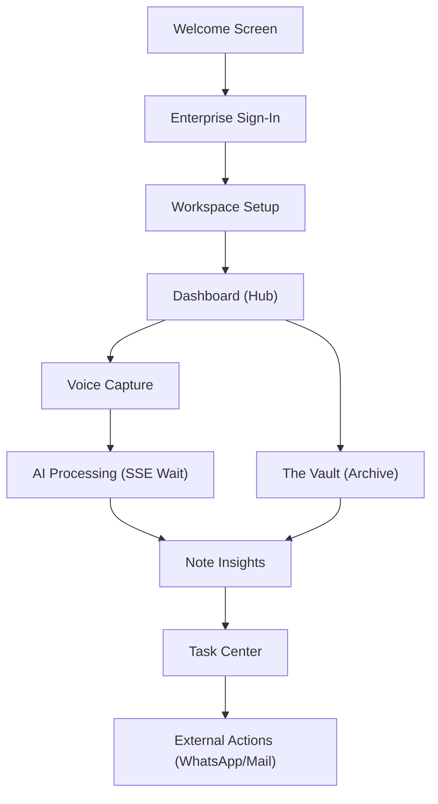

# VoiceNote App Overview & Workflow

This document outlines the end-to-end application workflow and the alignment of the frontend (Kotlin/Jetpack Compose) with the backend (FastAPI/VoiceNoteAPI).

## 🔄 Application Workflow

The following diagram illustrates the primary user journey from onboarding to actionable insights:



---

## 🔗 Screen to API Alignment

Every screen in the VoiceNote app is aligned with a specific backend endpoint. All requests and responses follow the high-fidelity schemas defined below.

### 1. Authentication & Onboarding
| Screen | Endpoint | Method | Request Payload | Key Response Fields |
| :--- | :--- | :--- | :--- | :--- |
| **Sign-In** | `/api/v1/users/login` | `POST` | `email`, `password`, `device_id`, `token` | `access_token`, `user.id`, `is_new_user` |
| **Workspace** | `/api/v1/users/sync` | `POST` | `email`, `device_model`, `timezone` | `user.primary_role`, `is_verified` |

### 2. Core Experience (Dashboard & Vault)
| Screen | Endpoint | Method | Request Payload | Key Response Fields |
| :--- | :--- | :--- | :--- | :--- |
| **Dashboard** | `/api/v1/notes/dashboard` | `GET` | N/A | `stats.meeting_roi`, `recent_notes`, `ai_insights` |
| **The Vault** | `/api/v1/notes` | `GET` | `skip`, `limit` | `List<NoteDetailResponse>` |
| **Real-time** | `/sse/events` | `Streaming` | N/A | `NOTE_PROCESSED`, `DASHBOARD_UPDATE` |

### 3. Note Intelligence
| Screen | Endpoint | Method | Request Payload | Key Response Fields |
| :--- | :--- | :--- | :--- | :--- |
| **Voice Capture** | `/api/v1/sync/upload-batch` | `POST (Multipart)` | `List<File>` | `batch_job_id`, `processed_count` |
| **Note Insights** | `/api/v1/notes/{id}` | `GET` | `id` | `transcript` (string), `semantic_analysis`, `tasks` |

### 4. Task Management
| Screen | Endpoint | Method | Request Payload | Key Response Fields |
| :--- | :--- | :--- | :--- | :--- |
| **Task Center** | `/api/v1/tasks/center` | `GET` | N/A | `attention_needed`, `priority_queue` |
| **Task Action** | `/api/v1/tasks/{id}/complete` | `PATCH` | `is_done: Boolean` | `is_done`, `updated_at` |

---

## 🛠️ Data Contracts (Highlights)

### Auth Sync Payload
```kotlin
data class UserSyncRequest(
    val email: String,
    val device_id: String,
    val device_model: String,
    val token: String, // Biometric/Device token
    val password: String? = null,
    val timezone: String? = "UTC"
)
```

### High-Fidelity Note Detail
```kotlin
data class NoteDetailResponse(
    val id: String,
    val title: String,
    val summary: String,
    val transcript: String, // Formatted text block
    val semantic_analysis: NoteSemanticAnalysis?,
    val tasks: List<NoteTask>?
)
```

### Smart Task Model
```kotlin
data class TaskResponse(
    val id: String,
    val description: String,
    val is_done: Boolean,
    val actions: Map<String, String>? // Deep links: {"WhatsApp": "tel:..."}
)
```

---

## 📡 Live Updates (SSE)
The app maintains a persistent connection to the backend via `SSEManager`. 
- **Trigger**: Upon successful file upload.
- **Event**: `NOTE_PROCESSED` → SDK triggers `DashboardViewModel.loadDashboard()` and `NoteViewModel.loadNotes()`.
